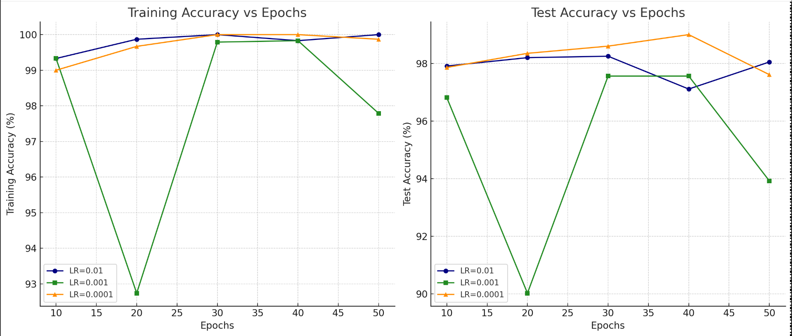
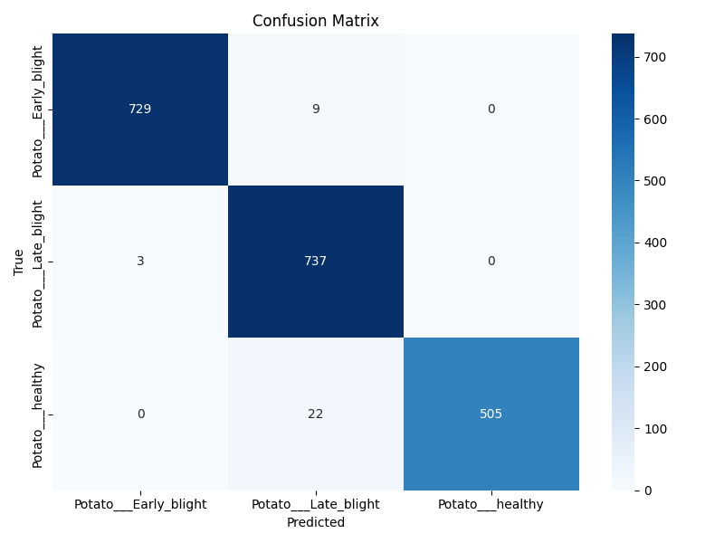
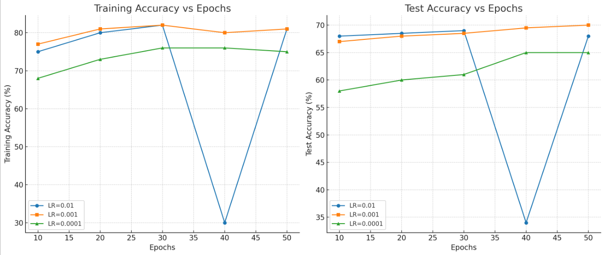
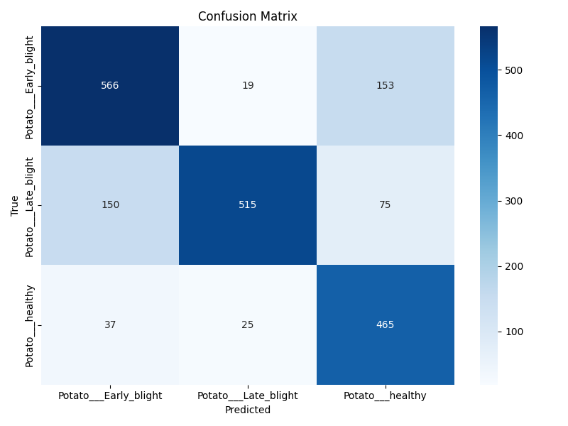
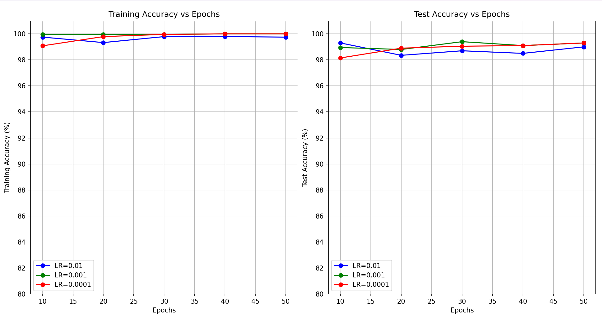
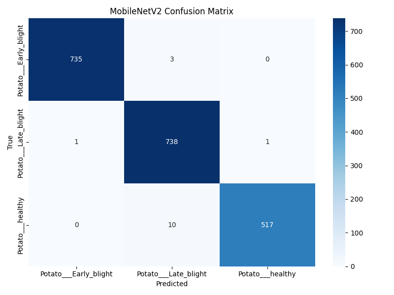

# Potato Disease Prediction Using Deep Learning

### Table of Contents

- [Project Overview](#project-overview)
- [Key Features](#key-features)
- [About Potato Diseases](#about-potato-diseases)
- [Tech Stack & Tools](#tech-stack--tools)
- [Project Description](#project-description-robust-potato-disease-classification-through-systematic-model-selection-and-hyperparameter-optimization-)
- [Comprehensive Evaluation and Analysis](#comprehensive-evaluation-and-analysis)
- [Web Application Integration](#web-application-integration)
- [Quick Setup & Run](#quick-setup--run)
- [Contributions](#contributions)
- [License](#license)
- [Contact](#contact)


### Project Overview
This project leverages state-of-the-art deep learning models to classify potato leaf diseases with high accuracy. Early detection helps farmers prevent crop loss and increase yield.

The three classes detected are:

* Potato Early Blight
* Healthy Potato Leaves
* Potato Late Blight

### Key Features

* Multi-class image classification of potato leaf diseases using CNN, MobileNet, and ResNet50.
* Data preprocessing pipeline with augmentation to improve model robustness.
* Rigorous 45 different hyperparameter and architecture configurations explored for each model to optimize performance.
* Web app with user authentication and live image upload for disease detection.
* Detailed evaluation with accuracy plots, confusion matrices, and classification reports.

### About Potato Diseases

| Disease        | Description                                                                                                          |
| -------------- | -------------------------------------------------------------------------------------------------------------------- |
| Early Blight   | Caused by the fungus *Alternaria solani*, it produces dark spots on older leaves, leading to premature leaf drop. Early detection is critical.          |
| Late Blight    | Caused by *Phytophthora infestans*, this aggressive disease causes rapid decay and significant yield loss. Often characterized by water-soaked lesions. |
| Healthy Leaves | Normal, disease-free potato leaves essential for photosynthesis and crop growth.                                                                        |


### Tech Stack & Tools
| Category             | Tools & Libraries        | 
| -------------------- | ------------------------ | 
| Programming Language | Python                   | 
| Deep Learning        | TensorFlow, Keras        | 
| Data Processing      | NumPy, Pandas            |  
| Web Framework        | Flask                    | 
| Database             | SQLite                   | 
| Visualization        | Matplotlib, Seaborn      | 

### Project Description: 
#### (Robust Potato Disease Classification through Systematic Model Selection and Hyperparameter Optimization)

We selected three deep learning architectures — a custom Convolutional Neural Network (CNN), MobileNet, and ResNet50 — chosen based on their complementary strengths and resource profiles:

* CNN: A lightweight model optimized for limited computational resources, enabling faster training and inference.
* MobileNet: A mobile-friendly architecture balancing accuracy and efficiency, ideal for deployment on resource-constrained devices.
* ResNet50: A deeper, more complex network capable of capturing intricate features but requiring higher computational power.

This diverse model set allows comprehensive exploration of trade-offs between model complexity, resource requirements, and predictive performance.

#### Extensive Hyperparameter Tuning: 45 Unique Configurations

To maximize performance and robustness, each architecture was trained across 45 distinct configurations, systematically varying key hyperparameters including:

* Learning rates to balance convergence speed and stability
* Batch sizes to optimize training dynamics and generalization
* Number of epochs to prevent underfitting or overfitting
* Optimizer algorithms (Adam) to identify the best optimization strategy
* Dropout rates for effective regularization
* Layer architectures such as convolutional filter sizes and dense neuron counts
* Data augmentation parameters (rotation, zoom, flipping) to improve model generalization

Training employed early stopping based on validation loss, ensuring each configuration reached optimal performance without overfitting.

#### Comprehensive Evaluation and Analysis

After training, results were meticulously analyzed through:

* Excel spreadsheets documenting raw metrics and hyperparameter settings  
* Accuracy and loss plots visualizing learning behavior across epochs  
* Confusion matrices assessing class-wise performance and error patterns  
* Classification reports summarizing precision, recall, and F1-scores for all classes  

---

#### CNN Model

  


---

#### ResNet50 Model

  


---

#### MobileNet Model

  


---

#### Analysis Summary

**Dataset size Original:** 848

#### CNN Model Performance 

**Training Accuracy:**  
- All learning rates reach nearly 100% training accuracy by 30–50 epochs.  
- LR = 0.001 shows instability around 20 epochs (drops to ~92.8%) — likely a training issue.

**Test Accuracy:**  
- LR = 0.0001 performs best and most stable, peaking at ~99% test accuracy at 40 epochs.  
- LR = 0.01 is also consistent (~98.2%) but slightly below LR=0.0001.  
- LR = 0.001 shows a sharp dip to 90% at 20 epochs, and stays volatile.

**Conclusion:**  
- Best Learning Rate: `0.0001`  
- Best Epoch Count: `40`  
- Reason: High and stable test accuracy (~99%), consistent training behavior, and no overfitting signs.

---

#### ResNet-50 Model Performance 

**Training Accuracy:**  
- LR = 0.001 achieves the highest and most stable training accuracy (~81–82%) across epochs.  
- LR = 0.01 shows instability, dropping sharply (~30% at 40 epochs) but recovers later.  
- LR = 0.0001 trains smoothly but with lower final accuracy (~75%).

**Test Accuracy:**  
- LR = 0.001 performs best and most consistently, reaching ~70% test accuracy at 50 epochs.  
- LR = 0.0001 is stable but lower (~65%).  
- LR = 0.01 is unstable, with a sharp dip (~34% at 40 epochs) but recovers to ~68%.

**Conclusion:**  
- Best Learning Rate: `0.001`  
- Best Epoch Count: `50`  
- Reason: Highest and most stable test accuracy (~70%) without sudden crashes, showing good generalization and training stability.

#### MobileNetV2 Model Performance 

**Training Accuracy:**  
- All learning rates (0.01, 0.001, 0.0001) achieve very high training accuracy (~99–100%) by 30–50 epochs.  
- LR = 0.0001 reaches 100% training accuracy fastest and remains very consistent.

**Test Accuracy:**  
- LR = 0.0001 gives the most stable and best test accuracy, peaking around 99%.  
- LR = 0.001 also performs well, peaking at ~99% but with slight fluctuation.  
- LR = 0.01 stays a bit lower (~98.5–98.8%) and has minor instability.

**Conclusion:**  
- Best Learning Rate: `0.0001`  
- Best Epoch Count: `40`  
- Reason: Achieves high and stable test accuracy (~99%) with smooth training, minimal overfitting, and fastest convergence.

---

| Model     | Best Learning Rate | Best Epochs | Test Accuracy (%) | Observations                                   |
|-----------|--------------------|-------------|-------------------|-----------------------------------------------|
| CNN       | 0.0001             | 40          | ~99%              | Very stable, no overfitting                    |
| ResNet-50 | 0.001              | 50          | ~70%              | Stable after 50 epochs, deeper model; harder training |
| MobileNet | 0.0001             | 40          | ~99%              | Fast convergence, very stable                  |

---

- CNN and MobileNet both achieve ~99% test accuracy, but MobileNet is more lightweight and efficient.  
- ResNet-50 is a more complex model needing careful tuning and achieves lower final accuracy without advanced techniques.

#### Web Application Integration

The best-performing model, selected based on thorough evaluation, is integrated into a Flask-based web interface allowing users to upload leaf images and receive disease predictions. This bridges the gap between research and practical agricultural use.

### Quick Setup & Run

1. Clone the repository

```bash
git clone https://github.com/nehasethii/potato-leaf-disease-prediction.git
cd potato-leaf-disease-prediction
````

2. Create and activate a virtual environment

```bash
python -m venv venv
```

Activate:

Windows:

```bash
venv\Scripts\activate
```

Linux/Mac:

```bash
source venv/bin/activate
```

3. Install dependencies

```bash
pip install -r requirements.txt
```

4. Initialize the database

```bash
python create_db.py
```

5. Run the app

```bash
python app.py
```

### Contributions

Contributions, issue reports, and feature requests are welcome! Please fork and submit a pull request.

---

### License

MIT License — see [LICENSE](LICENSE).

---

### Contact

Reach out via the contact page on the app or open an issue here on GitHub.

```